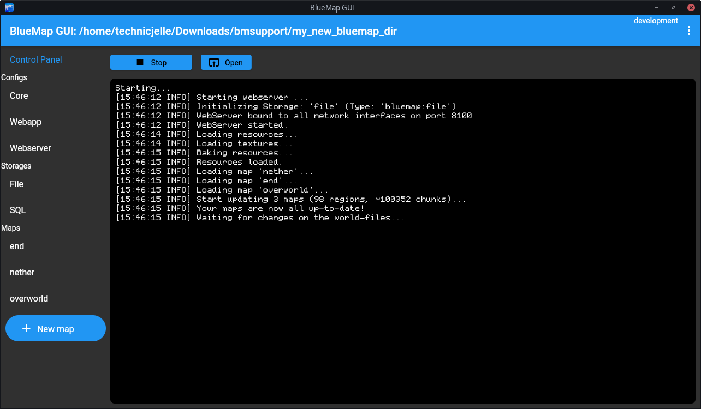

# BlueMap GUI
A GUI wrapper around the BlueMap CLI, mainly to make using BlueMap easier for single player worlds.

## Requirements
Make sure you have **Java 16** or higher installed and on your PATH!

## Usage
When you first open the program, it asks you to select a project directory.
I recommend making a new folder somewhere and using that one.

It will then download the BlueMap CLI tool into that folder,
and verify that it's the exact correct one, to prevent any suspicious files from being run.

Lastly, it'll generate all the default configs for you, and show them in the left sidebar.

You can then click the Start button to start BlueMap!

The first time, you will be instructed to accept the download in the core.conf file.
You can edit that very simply, inside BlueMap GUI by clicking the Core button in the left sidebar.

From there on, you have to configure your maps. I'll make a better workflow for that later.
For the time being, you have to copy the path to your world folder into the map config manually.
You can edit the map config in the built-in config editor, too.

## TODO
- java executable:
	- ~automatic (from the path)
	- ~custom location (file picker)
	- ~offer to download it locally to the project directory (from adoptium)
	- check if chosen version >=16
- make it not lose the process (orphan) as easily
	- when closing the program, it loses it
- config editor: horizontal scroll bar
- add gui for the (main) config options
	- accept download
	- adding & removing map configs
		- world path
		- map name
		- dimension key
		- button for adding a save (adds map configs for all dimensions in that save)
		- button for adding a single dimension
- allow users to select which minecraft version the project is
- support multiple projects
- (better) support multiple instances open at the same time
- test if bluemap updates work
	1. hardcode 5.0 version
	2. start new project
	3. render some stuff
	4. close program
	5. re-hardcode 5.3
	6. see if it automatically downloads 5.3
