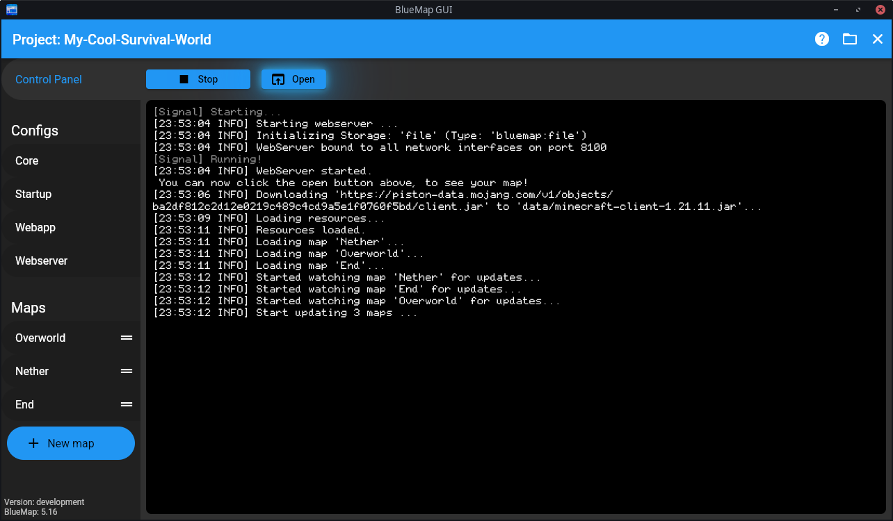
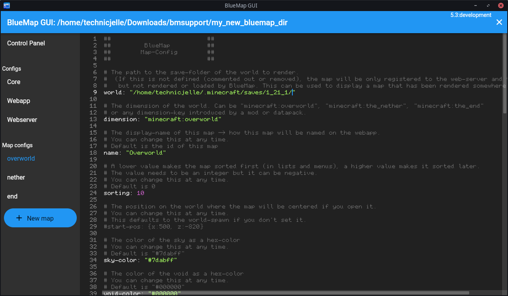

[](https://github.com/TechnicJelle/BlueMapGUI/releases/latest)


[](https://github.com/TechnicJelle/BlueMapGUI/actions/workflows/build.yml)

# BlueMap GUI

**Use BlueMap on your single-player worlds with ease!**

This program is a GUI wrapper around the BlueMap CLI tool,
which makes it easier to use for people who are not familiar with the command line,
don't have a server, or just want a more user-friendly experience.



## Requirements
Make sure you have **Java 21** or higher installed!

## [Click here to download!](../../releases/latest)

## Usage Guide
### 1. Setting up Java
When you first open the program, you will need to choose which Java version you want to use.  
It tries to automatically detect the Java version installed on your system.
If it couldn't find it, you can pick one manually.  
_I am planning on adding an Automatic Download button for Java
[in the future](https://github.com/TechnicJelle/BlueMapGUI/issues/18)._

### 2. Setting up a project
Once you've supplied a working Java version, you will be asked to select a project directory.  
I recommend making a new, empty folder somewhere and using that.

From now on, whenever you start BlueMap GUI, it will automatically open this project again.  
The current project can be closed by clicking the close button in the top right corner.  
You can always open it back up again, or you can make a new project by opening a new (empty) folder.  
_I'm planning on adding more proper project management
[in the future](https://github.com/TechnicJelle/BlueMapGUI/milestone/3)._

### 3. Setting up BlueMap
#### 3.a Accepting the download
You can now try to start BlueMap by clicking the `▶ Start` button.

But this first time, you will be instructed to accept a download in the Core config.  
This is because BlueMap needs to download some files from Mojang to work properly,
and according to the Mojang EULA, you have to manually confirm this download.  
Luckily, you can do this very simply, by clicking the Core button in the left sidebar.  
This will open the config editor, where you can edit the config file to accept the download.  
Just set the `accept-download` option to `true`.

#### 3.b Configuring your maps
Now, you have to configure your maps.  
Click the `+ New map` button in the sidebar, and in the popup,
choose a template (overworld, nether, or end) and type in a unique ID for the map.

Now, you need to set the path to your world folder by editing the map config.  
For the time being, you have to manually copy the path
to your world folder into the map config.  
_I'll make a simpler workflow for this [later](https://github.com/TechnicJelle/BlueMapGUI/milestone/2)._

Example paths:
##### Windows
```hocon
world: "C:/Users/TechnicJelle/AppData/Roaming/.minecraft/saves/1_20_4/"
```
> [!NOTE]  
> Make sure to use forward slashes (` / `) on Windows as well!  
> It likely copies the path with backslashes (` \ `), so you probably have to change them manually.

##### Linux
```hocon
world: "/home/technicjelle/.minecraft/saves/1_20_4/"
```

#### 3.c Starting BlueMap
Once you've set up all the maps you want to render,
you can go back to the Control Panel, and click the `▶ Start` button to start BlueMap!

You can view the progress and status in the console output,
and you can open the map by clicking the `⬆ Open` button.

## Support
To get help with this program, join the [BlueMap Discord server](https://bluecolo.red/map-discord)
and ask your questions in [#3rd-party-support](https://discord.com/channels/665868367416131594/863844716047106068).
You're welcome to ping me, @TechnicJelle.

## More screenshots



