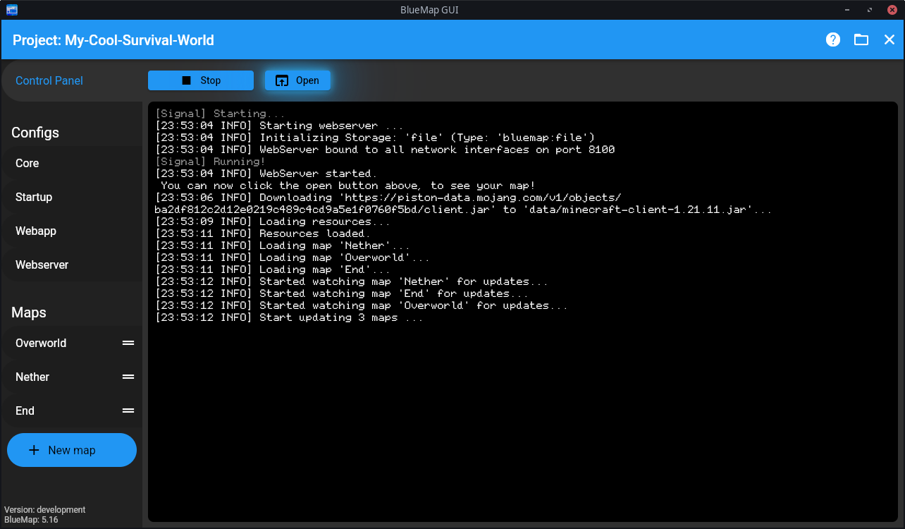
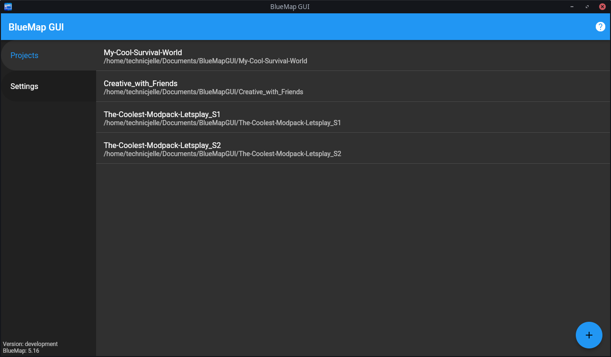
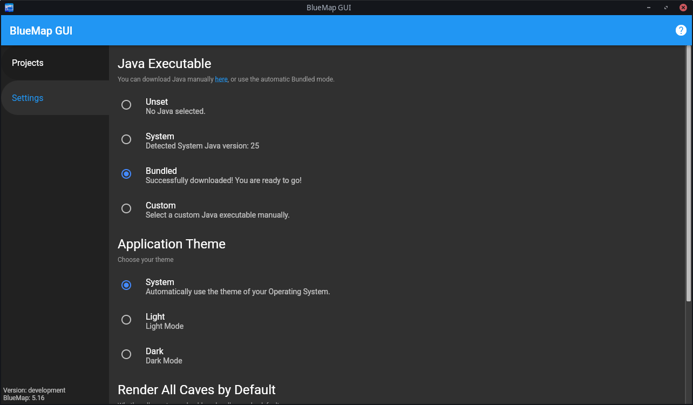
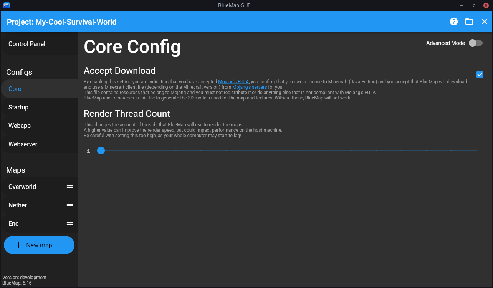
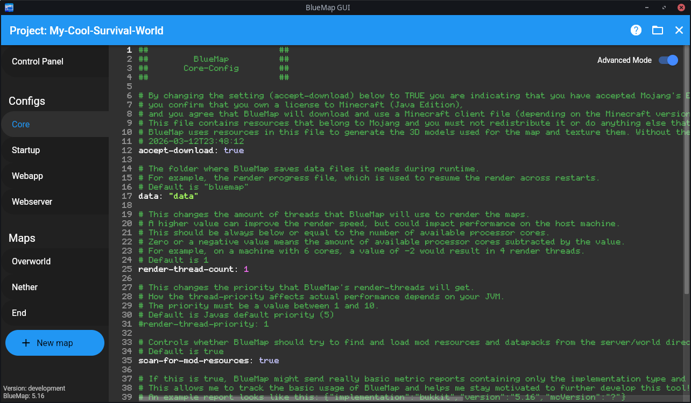
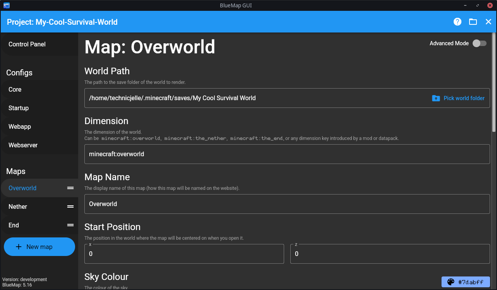
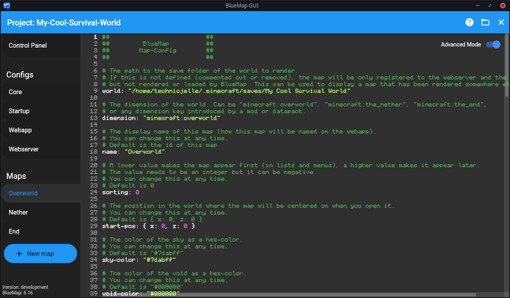

# BlueMap GUI

**Use BlueMap on your single-player worlds with ease!**

This program is a GUI wrapper around the BlueMap CLI tool,
which makes it easier to use for people who are not familiar with the command line,
don't have a server, or just want a more user-friendly experience.

## [Click here to download!](../../releases/latest)

## Support
To get help with this program, join the [BlueMap Discord server](https://bluecolo.red/map-discord)
and ask your questions in [#3rd-party-support](https://discord.com/channels/665868367416131594/863844716047106068).
You're welcome to ping me, @TechnicJelle.

## Building
1. Set up the [Flutter SDK](https://docs.flutter.dev/install)
2. Clone this repository
3. Run `flutter pub get` to install dependencies
4. Run `flutter run` to build and run the program

## More screenshots

