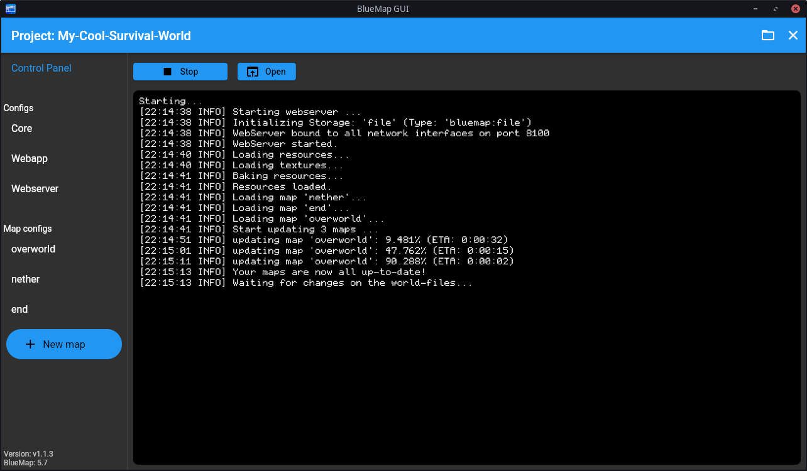

[](https://github.com/TechnicJelle/BlueMapGUI/releases/latest)


[](https://github.com/TechnicJelle/BlueMapGUI/actions/workflows/build.yml)

# BlueMap GUI

**Use BlueMap on your single-player worlds with ease!**

This program is a GUI wrapper around the BlueMap CLI tool,
which makes it easier to use for people who are not familiar with the command line,
don't have a server, or just want a more user-friendly experience.



## [Click here to download!](../../releases/latest)

## Usage Guide
### 1. Setting up Java
When you first open the program, you will need to choose which Java version you want to use.  
Go to the `Settings` tab in the sidebar on the left to select whether you want to:
- automatically detect the Java version installed on your system.
- pick a Java version manually. Useful if it couldn't automatically find it.  

_I am planning on adding an Automatic Download button for Java
[in the future](https://github.com/TechnicJelle/BlueMapGUI/issues/18)._

### 2. Creating a project
Once you've supplied a working Java version, go back to the `Projects` tab in the sidebar.  
You can create a new BlueMap project with the `(+)` button in the bottom right.  
Clicking this button opens a dialog where you can name your project.  
You can also choose a different place on your computer to store the project in, if you like.

Once you're happy with these settings, click the blue `Create` button.  
Your new BlueMap project is now in the projects list!  
Click on it to open it.

Opening will take a bit longer the first time, because it needs to download the BlueMap file.

You can return to the main menu by closing the project, by clicking the close button in the top right corner.

### 3. Setting up BlueMap
#### 3.a Accepting the download
You can now try to start BlueMap by clicking the `▶ Start` button.

But this first time, it will not work yet.
You will see instructions to accept a download in the Core config.

> This is because BlueMap needs to download some files from Mojang to work properly,
> and according to the Mojang EULA, you have to manually confirm this download.

Luckily, you can do this very simply, by clicking the Core button in the left sidebar.  
This will open the config editor, where you can edit the config to accept the download.  
Find the `accept-download` option, and change the `false` to `true`.

#### 3.b Configuring your maps
Now, you have to configure your maps.

Click the `+ New map` button in the sidebar.  
A dialog will open up where you need to choose a template (overworld, nether, or end)
and type in a unique ID for the map. This can be anything you like.

Now, you need to set the path to your world folder by editing the map config.  
For the time being, you have to manually copy the path
to your world folder into the map config.  
_I'll make a simpler workflow for this [later](https://github.com/TechnicJelle/BlueMapGUI/milestone/2)._

Example paths:
##### Windows
```hocon
world: "C:/Users/TechnicJelle/AppData/Roaming/.minecraft/saves/MyCoolWorld/"
```
> [!NOTE]  
> Make sure to use forward slashes (` / `) on Windows as well!  
> It likely copies the path with backslashes (` \ `), so you probably have to change them manually.

##### Linux
```hocon
world: "/home/technicjelle/.minecraft/saves/MyCoolWorld/"
```

#### 3.c (OPTIONAL) Setting up mods
[BlueMap supports (most) modded blocks.](https://bluemap.bluecolored.de/wiki/customization/Mods.html)  
However, BlueMapGUI does not auto-detect mods, so for the time being, you have to copy all of them manually to the `config/packs` folder in your project directory.  
_Adding mods will be made nicer [in the future](https://github.com/TechnicJelle/BlueMapGUI/issues/12)._

#### 3.d Starting BlueMap
Once you've set up all the maps you want to render,
you can go back to the Control Panel, and click the `▶ Start` button to start BlueMap!

You can view the progress and status in the console output,
and you can open the map by clicking the `⬆ Open` button.

## Support
To get help with this program, join the [BlueMap Discord server](https://bluecolo.red/map-discord)
and ask your questions in [#3rd-party-support](https://discord.com/channels/665868367416131594/863844716047106068).
You're welcome to ping me, @TechnicJelle.

## More screenshots


